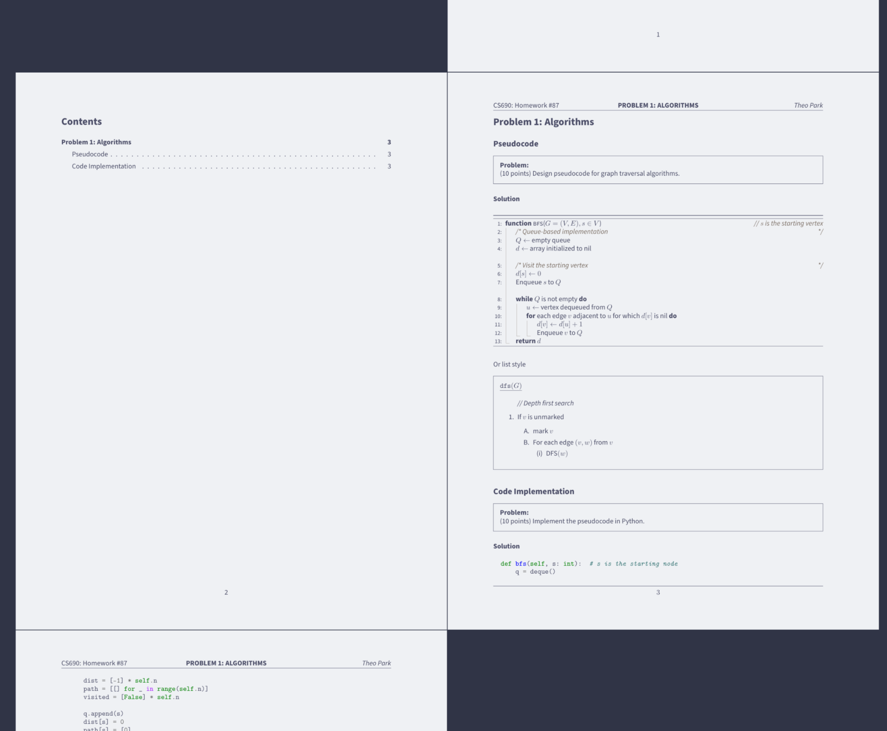

# My LaTeX Template

Some of the LaTeX templates I use.

## Homework template

Homework template I use for algorithms, linear algebra, and other CS/math classes that requires LaTeX.
Inspired by [jdavis's template](https://github.com/jdavis/latex-homework-template), but kept relatively simple (e.g., no complex counters), as well as lots of comments for what each packages and commands do to help my dumb self after each summer breaks.

